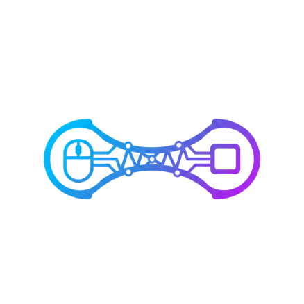

<p align="center">
  <!-- Replace this with your logo image -->
  
</p>

<h1 align="center">InputBridge</h1>

<p align="center">
  <strong>Share your keyboard & mouse across multiple PCs — securely, instantly, wirelessly.</strong>
</p>

<p align="center">
  
  
  
  
  
</p>

<p align="center">
  <a href="#-features">Features</a> •
  <a href="#-screenshots">Screenshots</a> •
  <a href="#-how-it-works">How It Works</a> •
  <a href="#-installation">Installation</a> •
  <a href="#%EF%B8%8F-quick-start-guide">Quick Start</a> •
  <a href="#-architecture">Architecture</a> •
  <a href="#-building-from-source">Build</a> •
  <a href="#-contributing">Contributing</a>
</p>

---

## 📖 What is InputBridge?

**InputBridge** is a software-based KVM (Keyboard, Video, Mouse) solution that lets you control multiple Windows PCs using a single keyboard and mouse — no extra hardware, cables, or KVM switches required. Just install it on your computers, connect over your local network, and seamlessly switch input between machines with a keyboard shortcut.

<!-- Replace this with a hero/banner image showing the concept -->
<p align="center">
  
</p>

> **Example use case:** You have a work PC and a personal PC on the same desk. Instead of switching between two keyboards, InputBridge lets you press `Ctrl+Win+2` to redirect all your input to the second computer — and `Ctrl+Win+1` to switch back. It's instant, encrypted, and zero-latency on LAN.

---

## ✨ Features

| Feature | Description |
|---|---|
| ⚡ **Sub-millisecond Latency** | Zero-allocation UDP transport designed for imperceptible input lag on LAN. Keyboard events are sent over TCP to guarantee delivery. |
| 🔐 **End-to-End Encryption** | All input data is encrypted with **AES-256-GCM** before it leaves your machine. Your keystrokes can never be eavesdropped on the network. |
| 🔍 **Automatic LAN Discovery** | Host broadcasts its presence on the network. The Client discovers it automatically — no need to manually type IP addresses. |
| 🎯 **Precise Input Simulation** | Uses Windows native `SendInput` API with both Virtual Key codes and Hardware Scan Codes for maximum compatibility, even in games. |
| 🎨 **Modern Dark UI** | Sleek WPF interface with dark theme, status indicators, and system tray integration. Runs quietly in the background. |
| ⌨️ **Customizable Hotkeys** | Change the switching hotkeys through the built-in settings panel. Emergency release (`Ctrl+Alt+Escape`) is always available. |
| 🔁 **Auto-Reconnect** | If the network drops, InputBridge automatically detects the disconnection and attempts to reconnect — no manual intervention needed. |
| 🛡️ **Keystroke Safety** | Keystroke values are **never logged** to disk. All keyboard data in logs is masked for security. |

---

## 📸 Screenshots

> **Note:** Replace the placeholder paths below with your actual screenshot images.

<p align="center">
  <strong>Host Application — Main Window</strong><br/>
  <em>Control center where you start connections, configure settings, and switch input modes.</em><br/><br/>
  <!-- Replace this with a screenshot of the Host window -->
  
</p>

<br/>

<p align="center">
  <strong>Client Application — Waiting for Connection</strong><br/>
  <em>Runs on the secondary PC. Once connected, it receives and simulates all input from the Host.</em><br/><br/>
  <!-- Replace this with a screenshot of the Client window -->
  
</p>

<br/>

<p align="center">
  <strong>Connected & Active</strong><br/>
  <em>Green status indicator shows an active connection with real-time latency monitoring.</em><br/><br/>
  <!-- Replace this with a screenshot showing the connected state -->
  
</p>

<br/>

<p align="center">
  <strong>Hotkey Settings</strong><br/>
  <em>Customize your switching hotkeys through the intuitive settings dialog.</em><br/><br/>
  <!-- Replace this with a screenshot of the hotkey settings dialog -->
  
</p>

<br/>

<p align="center">
  <strong>System Tray</strong><br/>
  <em>InputBridge runs in the background via the system tray for easy access.</em><br/><br/>
  <!-- Replace this with a screenshot of the system tray icon/menu -->
  
</p>

---

## ⚙️ How It Works

InputBridge operates as a **Host ↔ Client** pair over your local network:

```
┌─────────────────────────────────┐          LAN (Encrypted)          ┌─────────────────────────────────┐
│         HOST COMPUTER           │ ◄──────────────────────────────► │        CLIENT COMPUTER          │
│                                 │                                   │                                 │
│  Physical Keyboard & Mouse      │    ┌───────────────────────┐      │  Simulated Keyboard & Mouse     │
│          │                      │    │  AES-256-GCM Tunnel   │      │          │                      │
│          ▼                      │    │                       │      │          ▼                      │
│  Low-Level Windows Hooks        │    │  Keyboard → TCP       │      │  SendInput API                  │
│  (SetWindowsHookEx)             │───►│  Mouse    → UDP       │─────►│  (Native Windows Input)         │
│                                 │    │  Heartbeat → UDP      │      │                                 │
│  Captures ALL input events      │    └───────────────────────┘      │  Replays input as if local      │
└─────────────────────────────────┘                                   └─────────────────────────────────┘
```

### 🔄 Switching Modes

| Hotkey | Action | Description |
|---|---|---|
| `Ctrl + Win + 1` | **Switch to Host** | Input goes to your physical (local) PC |
| `Ctrl + Win + 2` | **Switch to Client** | Input is redirected to the remote PC |
| `Ctrl + Alt + Escape` | **Emergency Release** | Immediately releases all hooks and returns control to the local PC. Works under any circumstance. |

> 💡 Hotkeys are fully customizable through the **Hotkey Settings** panel.

### 🔐 Security Model

1. Both machines share a **Secret Key** (pre-shared passphrase).
2. On connection, a **challenge-response handshake** (HMAC-SHA256) verifies both parties know the key.
3. A unique **AES-256 session key** is derived for each connection.
4. **Every single packet** (keyboard, mouse, heartbeat) is encrypted with AES-256-GCM.
5. GCM mode provides both **confidentiality** and **integrity** — tampered packets are rejected.

---

## 📥 Installation

### Download Pre-built Binaries (Recommended)

1. Go to the [**Releases**](../../releases) page.
2. Download the latest `InputBridge_Release_v*.zip`.
3. Extract the archive — you will find two folders:
   - `InputBridge.Host/` — for your **primary** PC (the one with the physical keyboard & mouse)
   - `InputBridge.Client/` — for your **secondary** PC (the one you want to control remotely)
4. **No installation required.** Just run the `.exe` files.

### System Requirements

| Requirement | Details |
|---|---|
| **OS** | Windows 10 / 11 (64-bit) |
| **Runtime** | .NET 8.0 Desktop Runtime ([download](https://dotnet.microsoft.com/download/dotnet/8.0)) |
| **Network** | Both PCs must be on the same LAN (Wi-Fi or Ethernet) |
| **Firewall** | Allow TCP/UDP port **7201** (configurable) |

---

## 🚀️ Quick Start Guide

Follow these steps to get InputBridge running in under 2 minutes:

### Step 1 — Set up the Host (Primary PC)

<!-- Replace this with a screenshot highlighting the Host setup steps -->
<p align="center">
  
</p>

1. Run `InputBridge.Host.exe` on the computer that has the physical keyboard and mouse.
2. Enter a **Secret Key** — this can be any passphrase (e.g., `mySecureKey123`).
3. Set the **TCP Port** (default `7201` works for most cases).
4. Click **"Start Connection"**.
5. The status will show **"Waiting for Connection..."** until the Client connects.

### Step 2 — Set up the Client (Secondary PC)

<!-- Replace this with a screenshot highlighting the Client setup steps -->
<p align="center">
  
</p>

1. Run `InputBridge.Client.exe` on the computer you want to control remotely.
2. Enter the **exact same Secret Key** you used on the Host.
3. Click **"Connect"**.
4. The Client will automatically discover the Host on the network and establish a secure connection.

### Step 3 — Switch & Control

<!-- Replace this with an image/diagram showing the switching concept -->
<p align="center">
  
</p>

- Press **`Ctrl + Win + 2`** → Your keyboard and mouse now control the **Client PC**.
- Press **`Ctrl + Win + 1`** → Your keyboard and mouse return to controlling the **Host PC**.
- If anything goes wrong, press **`Ctrl + Alt + Escape`** to immediately release all input.

✅ **You're done!** The connection status will show as green with real-time latency.

---

## 🏗 Architecture

InputBridge is structured as a clean, modular .NET 8 solution with clear separation of concerns:

```
InputBridge.sln
│
├── src/
│   ├── InputBridge.Core/          # Shared library — networking, crypto, protocol
│   │   ├── Protocol/             # InputPacket struct (24 bytes), serialization, handshake
│   │   ├── Network/              # UDP & TCP transports, LAN discovery service
│   │   ├── Crypto/               # AES-256-GCM encryption/decryption
│   │   ├── Configuration/        # Settings management (JSON-based)
│   │   └── Logging/              # Serilog-based logger with keystroke masking
│   │
│   ├── InputBridge.Host/          # WPF app — runs on the primary PC
│   │   ├── Hooks/                # Low-level keyboard & mouse hooks (SetWindowsHookEx)
│   │   ├── Services/             # Connection manager, input router
│   │   └── UI/                   # Theme resources, styles
│   │
│   ├── InputBridge.Client/        # WPF app — runs on the secondary PC
│   │   ├── Simulation/           # Keyboard & mouse simulators (SendInput API)
│   │   └── Services/             # Client-side connection handler
│   │
│   └── InputBridge.Shared.UI/    # Shared WPF styles and themes
│
└── tests/
    └── InputBridge.Core.Tests/    # Unit tests for protocol, crypto, network
```

### Data Flow Diagram

```
                ┌──────────────────────────────────────────────────────┐
                │                   HOST PC                            │
                │                                                      │
                │   Keyboard ──► KeyboardHook ──┐                      │
                │                               ├──► InputRouter       │
                │   Mouse ────► MouseHook ──────┘        │             │
                │                                        │             │
                │                              ┌─────────┴──────────┐  │
                │                              │   PacketSerializer  │  │
                │                              │         +           │  │
                │                              │   AesTransport      │  │
                │                              │     (Encrypt)       │  │
                │                              └─────────┬──────────┘  │
                │                                        │             │
                │                              Keyboard:TCP  Mouse:UDP │
                └────────────────────────────────────┬─────────────────┘
                                                     │
                                              ═══════╪═══════  LAN
                                                     │
                ┌────────────────────────────────────┬─────────────────┐
                │                                    │  CLIENT PC      │
                │                              ┌─────┴──────────┐      │
                │                              │  AesTransport   │      │
                │                              │   (Decrypt)     │      │
                │                              │       +         │      │
                │                              │ PacketSerializer│      │
                │                              └─────┬──────────┘      │
                │                                    │                  │
                │                         ┌──────────┴──────────┐      │
                │                         │                     │      │
                │                KeyboardSimulator      MouseSimulator │
                │                  (SendInput)          (SendInput)    │
                │                         │                     │      │
                │                         ▼                     ▼      │
                │                  Virtual Keyboard      Virtual Mouse  │
                └──────────────────────────────────────────────────────┘
```

### Network Protocol

| Channel | Protocol | Used For | Why |
|---|---|---|---|
| Keyboard Events | **TCP** | Key down/up events | Every keystroke must arrive — TCP guarantees delivery |
| Mouse Events | **UDP** | Movement, clicks, scroll | Speed over reliability — a dropped mouse move is instantly corrected by the next one |
| Heartbeat | **UDP** | Connection health check | Sent every 1 second. 3 missed heartbeats = connection lost |
| Handshake | **TCP** | Initial auth & key exchange | Challenge-response with HMAC-SHA256, then AES session key exchange |

### Packet Format

Every input event is serialized into a compact **24-byte** struct:

```
┌─────────┬──────────┬───────────┬────────┬────────┬────────────┬────────────────┐
│ Version │   Type   │   Flags   │ Data1  │ Data2  │ Timestamp  │ SequenceNumber │
│ 1 byte  │  1 byte  │  2 bytes  │ 4 bytes│ 4 bytes│  8 bytes   │    4 bytes     │
└─────────┴──────────┴───────────┴────────┴────────┴────────────┴────────────────┘
                                    Total: 24 bytes per packet
                          After encryption: 52 bytes (24 + 12 IV + 16 auth tag)
```

---

## 🔧 Building from Source

### Prerequisites

- [.NET 8.0 SDK](https://dotnet.microsoft.com/download/dotnet/8.0) or later
- Windows 10/11 (required for WPF)

### Build

```bash
# Clone the repository
git clone https://github.com/onderaktas54/InputBridge.git
cd InputBridge

# Build the entire solution
dotnet build InputBridge.sln -c Release

# Run tests
dotnet test InputBridge.sln
```

### Publish (Create portable executables)

```bash
# Publish Host
dotnet publish src/InputBridge.Host/InputBridge.Host.csproj -c Release -r win-x64 --self-contained

# Publish Client
dotnet publish src/InputBridge.Client/InputBridge.Client.csproj -c Release -r win-x64 --self-contained
```

The output will be in `src/InputBridge.Host/bin/Release/net8.0-windows/win-x64/publish/` and the equivalent Client path.

---

## 🤝 Contributing

Contributions are welcome! Here's how you can help:

1. **Fork** the repository
2. **Create** a feature branch: `git checkout -b feature/amazing-feature`
3. **Commit** your changes: `git commit -m 'Add amazing feature'`
4. **Push** to the branch: `git push origin feature/amazing-feature`
5. **Open** a Pull Request

### Development Notes

- The project uses **C# 12** with nullable reference types enabled.
- All warnings are treated as errors (`TreatWarningsAsErrors`).
- Run `dotnet test` before submitting any PR.

---

## 🗺 Roadmap

- [ ] Multi-client support (control 3+ PCs)
- [ ] Clipboard sharing between Host and Client
- [ ] Cross-platform Client (Linux/macOS)
- [ ] File drag & drop between machines
- [ ] Monitor-edge switching (move mouse to screen edge to switch)

---

## ❓ FAQ

<details>
<summary><strong>Is my data safe? Can someone on my network see what I type?</strong></summary>
<br/>
No. All keyboard and mouse data is encrypted with <strong>AES-256-GCM</strong> before it leaves your computer. Even if someone captures the network packets, they cannot decrypt the contents without your secret key. Additionally, GCM mode ensures packet integrity — any tampered data is automatically rejected.
</details>

<details>
<summary><strong>What happens if the network drops? Will my keyboard get stuck?</strong></summary>
<br/>
InputBridge includes automatic disconnection detection via heartbeat monitoring. If the connection drops, the Host immediately releases all hooks and returns control to your local PC. The Client also releases any pressed keys to prevent "stuck key" issues. Reconnection is attempted automatically.
</details>

<details>
<summary><strong>Does it work over the internet (WAN)?</strong></summary>
<br/>
InputBridge is designed for <strong>LAN use only</strong> (same local network). While it could theoretically work over the internet with port forwarding, it is not recommended due to latency and security considerations.
</details>

<details>
<summary><strong>What is the latency?</strong></summary>
<br/>
On a typical LAN (Ethernet or Wi-Fi 5/6), latency is <strong>sub-1ms</strong> — completely imperceptible to humans. The compact 24-byte packet format and zero-allocation network stack ensure minimal overhead.
</details>

<details>
<summary><strong>Does it work with games?</strong></summary>
<br/>
Yes. InputBridge uses both Virtual Key codes and Hardware Scan Codes via the <code>SendInput</code> API, which provides the highest compatibility with games and applications that use DirectInput or raw input.
</details>

<details>
<summary><strong>Can I change the hotkeys?</strong></summary>
<br/>
Yes! Click the <strong>"Hotkey Settings"</strong> button on the Host window to customize the switching shortcuts. The emergency release hotkey (<code>Ctrl+Alt+Escape</code>) is always active and cannot be changed for safety reasons.
</details>

---

## 📄 License

This project is licensed under the [MIT License](LICENSE).

---

<p align="center">
  <strong>Made with ❤️ by <a href="https://github.com/onderaktas54">Önder Aktaş</a></strong>
</p>

<p align="center">
  <em>If you find InputBridge useful, consider giving it a ⭐ on GitHub!</em>
</p>
