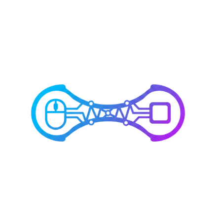

  

<h1 align="center">InputBridge</h1>

  <strong>One keyboard and mouse. Two computers. One secure bridge.</strong>

  A lightweight, open-source network KVM for Windows and Linux.

  
  
  
  

  <a href="#features">Features</a> ·
  <a href="#platforms">Platforms</a> ·
  <a href="#quick-start">Quick start</a> ·
  <a href="#how-it-works">How it works</a> ·
  <a href="#security">Security</a> ·
  <a href="#build">Build</a> ·
  <a href="#faq">FAQ</a>

  

  <a href="https://github.com/onderaktas54/InputBridge/releases/latest"><strong>Download latest release</strong></a>
  &nbsp;·&nbsp;
  <a href="docs/LINUX.md"><strong>Linux setup guide</strong></a>
  &nbsp;·&nbsp;
  <a href="https://github.com/onderaktas54/InputBridge/issues"><strong>Report an issue</strong></a>

> [!NOTE]
> InputBridge is designed for computers on the same trusted local network. A Host captures your physical input; a Client securely replays it on the other machine.

## ✨ Features

| | |
|---|---|
| ⚡ **Low-latency input** | Keyboard events use reliable TCP; mouse movement uses low-overhead UDP. |
| 🔐 **Authenticated encryption** | Input packets are protected with AES-256-GCM after an HMAC-SHA256 challenge-response handshake. |
| 🔎 **LAN discovery** | Clients can find the Host automatically, or connect directly to a known IP address. |
| 🪟 **Native Windows input** | Windows uses low-level hooks for capture and <code>SendInput</code> for replay. |
| 🐧 **X11 + Wayland** | Linux works at the kernel input layer with evdev and <code>/dev/uinput</code>. |
| ⌨️ **Fast switching** | Switch machines with a hotkey and use the emergency release shortcut whenever needed. |
| 🔁 **Connection recovery** | Heartbeats detect dropped sessions and release held input safely. |
| 🕶️ **Privacy-minded logs** | Keystroke values are masked instead of being written to disk. |

## 🖥️ Platforms

| Platform | Host — controls another PC | Client — is controlled remotely | Interface |
|---|:---:|:---:|---|
| **Windows 10/11 x64** | ✅ | ✅ | WPF desktop app + system tray |
| **Linux x64** | ✅ | ✅ | Headless CLI |
| **Linux display server** | X11 / Wayland | X11 / Wayland | evdev + uinput |
| **macOS** | ❌ | ❌ | Planned |

Windows and Linux speak the same protocol, so mixed setups work in either direction:

- Windows Host → Linux Client
- Linux Host → Windows Client
- Windows Host → Windows Client
- Linux Host → Linux Client

For Linux permissions, hotkeys and key-map notes, see the complete **[Linux guide](docs/LINUX.md)**.

## 🚀 Quick start

### 1. Download

Open the **[latest release](https://github.com/onderaktas54/InputBridge/releases/latest)** and choose the package for each computer:

| Package | Put it on |
|---|---|
| <strong>InputBridge_Host_*.zip</strong> | The Windows PC with the physical keyboard and mouse |
| <strong>InputBridge_Client_*.zip</strong> | The Windows PC you want to control |
| <strong>InputBridge_Linux_x64_*.tar.gz</strong> | A Linux PC in either Host or Client mode |

Release archives are self-contained. You do not need to install .NET separately.

### 2. Start both ends

<strong>Windows → Windows or Linux</strong>

 

1. Run <strong>InputBridge.Host.exe</strong> on the computer with the keyboard and mouse.
2. Enter a unique shared secret of at least 16 characters and start the Host.
3. Run the Client on the other computer and enter the exact same secret.
4. Let LAN discovery find the Host, then connect.

<strong>Linux as the Client</strong>

 

~~~bash
INPUTBRIDGE_SECRET='use-a-long-random-secret' ./inputbridge-linux client

# Skip discovery and connect directly:
INPUTBRIDGE_SECRET='use-a-long-random-secret' \
  ./inputbridge-linux client --host 192.168.1.20
~~~

<strong>Linux as the Host</strong>

 

~~~bash
INPUTBRIDGE_SECRET='use-a-long-random-secret' ./inputbridge-linux host
~~~

Linux needs permission to access kernel input devices. Install the bundled
<strong>99-inputbridge.rules</strong> udev rule once; the **[Linux guide](docs/LINUX.md#running-without-sudo-udev-rule)**
contains the safe setup steps.

### 3. Switch control

| Host | Shortcut | Action |
|---|---|---|
| Windows | <kbd>Ctrl</kbd> + <kbd>Win</kbd> + <kbd>1</kbd> | Return input to the local Host |
| Windows | <kbd>Ctrl</kbd> + <kbd>Win</kbd> + <kbd>2</kbd> | Forward input to the Client |
| Windows | <kbd>Ctrl</kbd> + <kbd>Alt</kbd> + <kbd>Esc</kbd> | Emergency release |
| Linux | <kbd>Ctrl</kbd> + <kbd>Alt</kbd> + <kbd>S</kbd> | Toggle forwarding |
| Linux | <kbd>Ctrl</kbd> + <kbd>Alt</kbd> + <kbd>Esc</kbd> | Emergency release |

> [!TIP]
> Ethernet gives the most consistent experience, but a healthy local Wi-Fi network also works well.

## 🌉 How it works

~~~mermaid
flowchart LR
    K["Keyboard + mouse"] --> H["Host capture"]
    H -->|"Keyboard · TCP"| E["AES-256-GCM bridge"]
    H -->|"Mouse · UDP"| E
    E --> C["Client replay"]
    C --> O["Remote operating system"]

    classDef edge fill:#071526,stroke:#00b8d9,color:#e6fbff,stroke-width:2px;
    classDef secure fill:#1c1233,stroke:#8b5cf6,color:#f3e8ff,stroke-width:2px;
    class K,H,C,O edge;
    class E secure;
~~~

The shared Core library owns discovery, networking, packet serialization, the handshake and encryption. Each platform only implements native input capture and replay.

| Channel | Transport | Purpose |
|---|---|---|
| Keyboard | TCP | Preserve every key-down and key-up event |
| Mouse | UDP | Prioritize fresh movement with minimal delay |
| Heartbeat | UDP | Detect a lost peer and release held input |
| Handshake | TCP | Authenticate the shared secret and establish the session |

## 🔒 Security

1. Both machines are configured with the same pre-shared secret.
2. HMAC-SHA256 challenge-response proves both peers know it.
3. Each connection derives fresh session material.
4. AES-256-GCM encrypts and authenticates input packets.
5. Invalid or tampered packets are rejected.

> [!IMPORTANT]
> Use a long, random, unique secret and keep InputBridge on a trusted LAN. The project is not designed to expose its ports directly to the public internet.

## 🧰 Build from source

### Linux

Install the .NET 8 SDK or newer, then build only the Linux project:

~~~bash
dotnet test tests/InputBridge.Core.Tests/InputBridge.Core.Tests.csproj -c Release
dotnet test tests/InputBridge.Linux.Tests/InputBridge.Linux.Tests.csproj -c Release
dotnet publish src/InputBridge.Linux/InputBridge.Linux.csproj \
  -c Release -r linux-x64 --self-contained
~~~

Building the full solution on Linux includes Windows-only WPF projects and therefore requires Windows targeting.

### Windows

~~~powershell
dotnet test InputBridge.sln -c Release
dotnet publish src/InputBridge.Host/InputBridge.Host.csproj -c Release -r win-x64 --self-contained
dotnet publish src/InputBridge.Client/InputBridge.Client.csproj -c Release -r win-x64 --self-contained
~~~

<strong>Repository layout</strong>

 

~~~text
src/
├── InputBridge.Core/       Networking, protocol, discovery and crypto
├── InputBridge.Host/       Windows input capture and routing
├── InputBridge.Client/     Windows input replay
├── InputBridge.Linux/      Linux Host and Client CLI
└── InputBridge.Shared.UI/  Shared WPF theme and tray services

tests/
├── InputBridge.Core.Tests/
└── InputBridge.Linux.Tests/
~~~

## ❓ FAQ

<strong>Will it work between Windows and Linux?</strong>

 
Yes. Both editions share the same wire protocol. Linux can be either the Host or Client and works under X11 and Wayland.

<strong>Why does Linux need input-group access?</strong>

 
The Client creates a virtual keyboard and mouse through <code>/dev/uinput</code>; the Host reads physical devices through evdev. The bundled udev rule grants those permissions without running the network-facing app as root. Only trusted local users should join the input group.

<strong>What if the network drops or a key gets stuck?</strong>

 
Heartbeat monitoring ends the session, releases captured input and clears pressed keys. The emergency release shortcut is also always available.

<strong>Does it work over the internet?</strong>

 
InputBridge targets trusted local networks. Do not forward its ports directly to the public internet; use a private VPN if you need to bridge two trusted networks.

<strong>Are all Linux keyboard layouts supported?</strong>

 
The current Linux-to-Windows key map targets a US layout. Other layouts may need additional mappings; please open an issue with the affected keys.

## 🤝 Contributing

Issues and pull requests are welcome. Before opening a PR:

~~~bash
dotnet test tests/InputBridge.Core.Tests/InputBridge.Core.Tests.csproj -c Release
dotnet test tests/InputBridge.Linux.Tests/InputBridge.Linux.Tests.csproj -c Release
~~~

Please keep new warnings at zero; the repository treats warnings as errors.

## 🗺️ Roadmap

- [ ] Multi-client control
- [ ] Clipboard sharing
- [ ] Monitor-edge switching
- [ ] File transfer
- [ ] macOS support
- [x] Windows ↔ Linux interoperability

## 📄 License

InputBridge is available under the **[MIT License](LICENSE)**.

  Built with care by <a href="https://github.com/onderaktas54">Önder Aktaş</a>.
  If InputBridge helps your setup, a ⭐ makes the bridge brighter.

